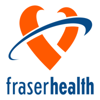
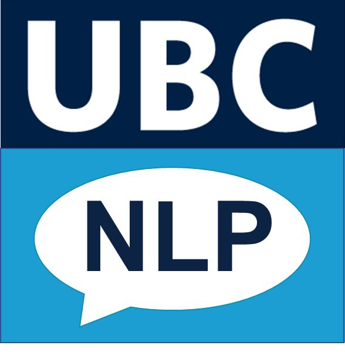
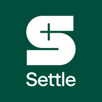
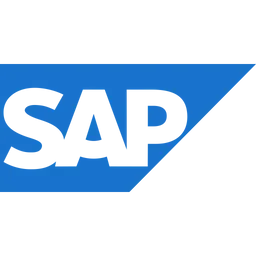
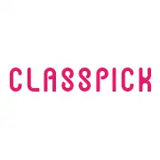
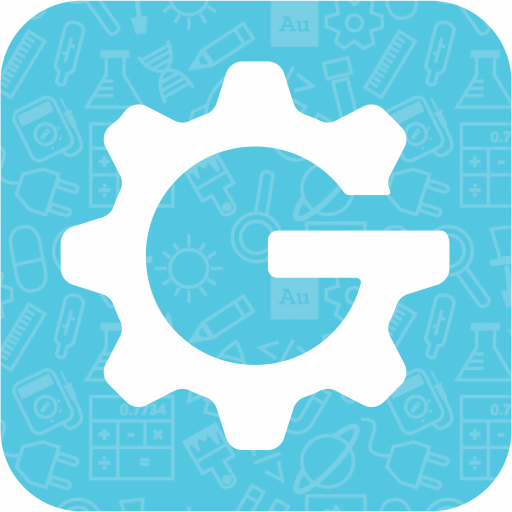
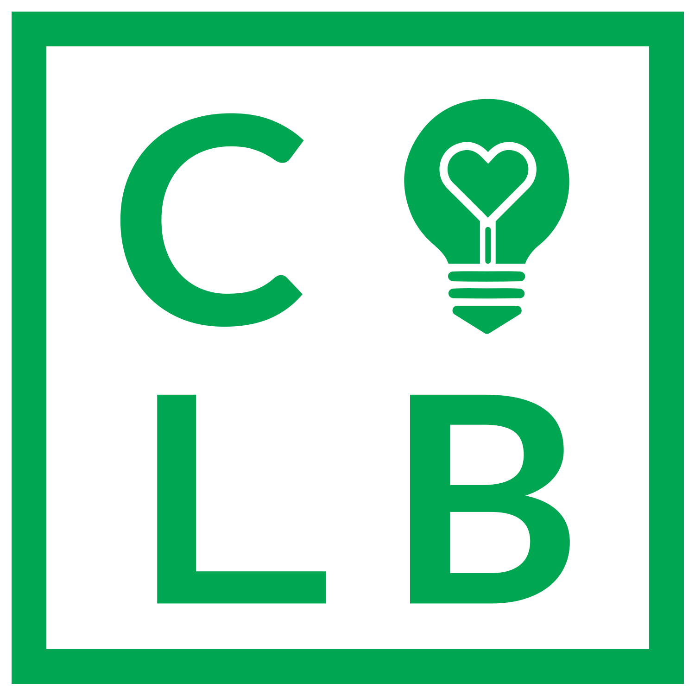
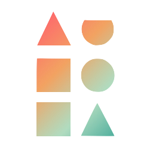
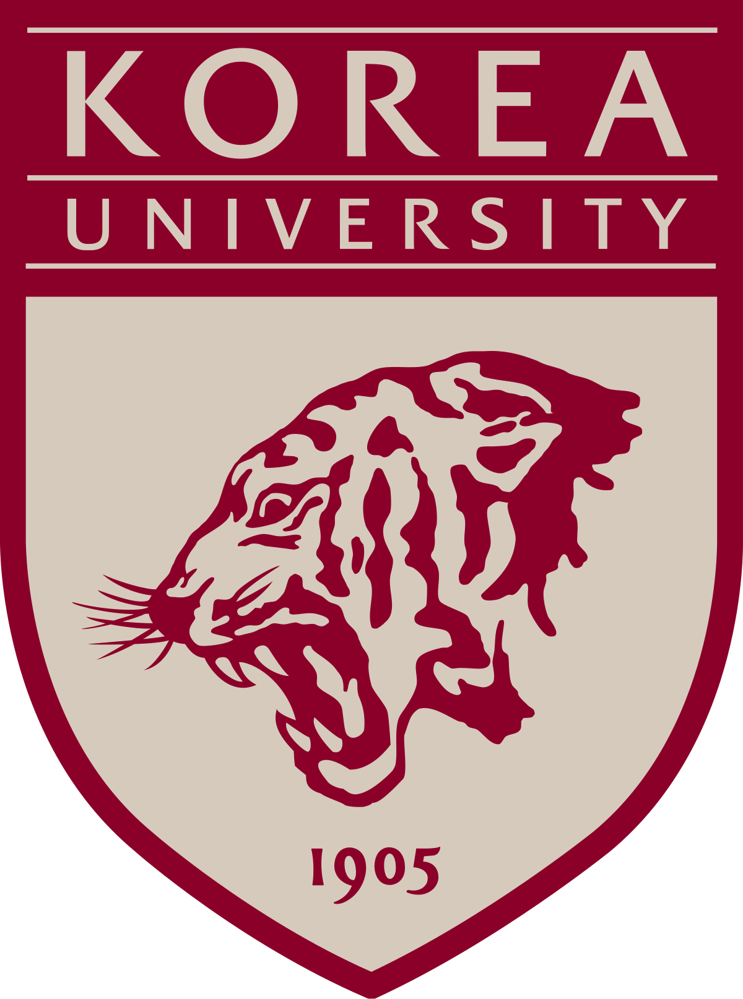

Taekyu Kang

**Software Engineer | Machine Learning Engineer | Applied Scientist
🏢** Currently @ F**raser Health** & **UBC NLP Lab** (Prev. @ **Settle &** **SAP**)
🏫 Master of Data Science in Computational Linguistics @ UBC
🏫 Bachelor of Applied Science in Computer Engineering & Minor in Business @ UBC

[LinkedIn](https://www.linkedin.com/in/kang-david/) | [GitHub](https://github.com/tkang7)

---

## 🚀 About Me

I'm an ⚙️ **Engineer**, 🧠 **Researcher,** and **💡Entrepreneur** and I make elegantly professional 💻 **Software** and 🤖 **AI** **Applications** (LLM Agents, RAG, Fine-tuned Models) that are 🏛️ **Business Objective Oriented**.

- 🧠 **AI Research** — Focused on NLP, LLMs, Multi-Modality, and Model Reasoning and Optimization.
- 💻 **Engineering Rigor** — Shipped production systems at companies like **Settle** and **SAP**, where I worked on APIs, scalable backends, and NLP pipelines.
- 🌎 **Entrepreneurship** — Founder of 2 Canadian non-profit organizations (**Campus Lightbox**) and (**Project Aurora Mental Health Foundation**) to tackle mental health with tech-driven solutions.
- 🤝 **Collaboration & Curiosity** — Whether working with professors at UBC or cross-functional teams in industry, I thrive on learning and solving problems together.

---

## 🛠️ Projects & Research

Check out my repos for a mix of:

### 🔬 Research

- 📄 Bridging Information Gaps with Comprehensive Answers: Improving the Diversity and Informativeness of Follow-Up Questions [[ArXiv Preprint Link](https://arxiv.org/abs/2502.17715)]
  **Taekyu Kang***, Zhe Liu*, Haoyu Wang, Seyed Hossein Alavi, Vered Shwartz
  In Submission to ACL 2025
- 📄 (Ongoing) MLLM Hallucination
- 📄 (Ongoing) FHVC Webchat Analysis and Optimization

### 💻 Engineering

- **🌐 Software**: [React/Next.js Web Platforms](https://github.com/campuslightbox/Campus-Lightbox), [Full-Stack Applications](https://github.com/masottile/contrio-nvd), Internal BI Dashboards, and Ruby on Rails Microservices
- **📊 Machine Learning**: [RNN/CNN/LSTM](https://github.com/tkang7/ml_models), Supervised/Unsupervised Models, Polynomial Regression, Tree-based Modelsideo-to-Text), [LLM Agents](https://github.com/tkang7/LLM-Agent-for-Sentiment-Analysis-and-Detoxification), RAG System
- **☁️ Large-Language Model**: [Encoder/Decoder Transformers](https://github.com/zheliu92/nlp_followupqg_public), Multimodal LLM (Image/Video-to-Text), [LLM Agents](https://github.com/tkang7/LLM-Agent-for-Sentiment-Analysis-and-Detoxification), RAG System

---

## 🛠️ Professional Affliations

</a>
</a>
</a>
</a>
</a>
</a>
</a>
</a>
</a>

</a>

> “Language is the most powerful tool humans have — I’m here to help machines use it wisely.”

Thanks for stopping by!
